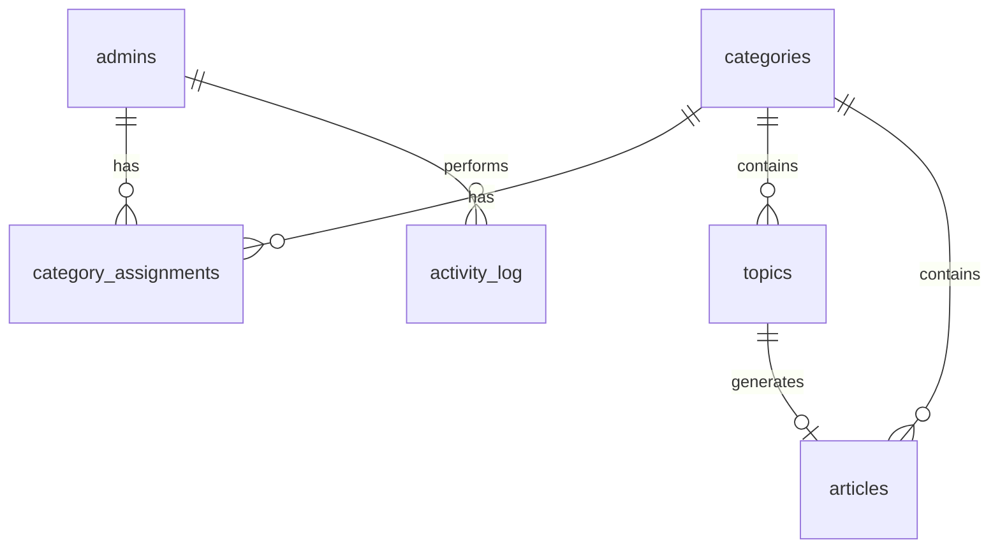
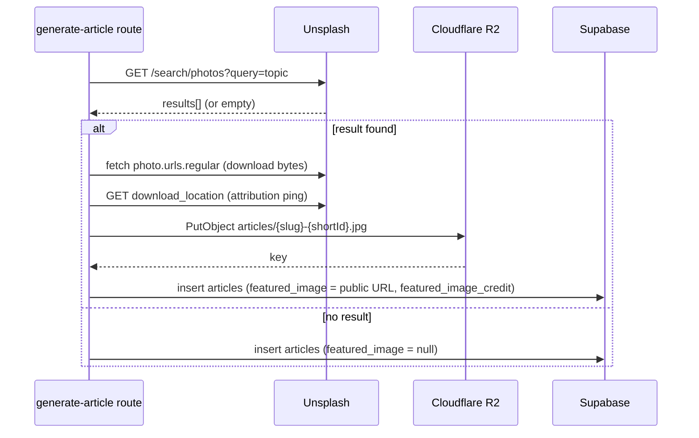

# AI Blog Generator Platform — Implementation Plan

## 0. Explicit assumptions (decided so no further clarification is needed)

- **Scheduling mechanism (confirmed with user):** a Cloudflare Cron Trigger drives real auto-publish. `articles.status` includes `scheduled`; a `scheduled_at` timestamp is set; a Worker `scheduled()` handler (added via an OpenNext "custom worker" wrapper) runs every few minutes, finds due rows with the `sb_secret` client, and flips them to `published`. This is the one deliberate deviation from the source doc's "no automation" line, and is the only cron in the system.
- **AI provider:** one interchangeable service module (`lib/ai.ts`) using an OpenAI-Chat-Completions-compatible HTTP API with JSON-mode/structured output. Swapping providers = editing this file only.
- **Image re-encoding:** `sharp` and other native image libs do not run on the Workers runtime. Images are stored in R2 in their original downloaded format (Unsplash serves JPEG) rather than converted to `.webp`, e.g. `articles/{slug}-{shortId}.jpg`. Noted as a deviation from the doc's `.webp` example naming.
- **Unsplash attribution:** Unsplash's API terms require attributing the photographer and pinging their download-tracking endpoint. Add a nullable `featured_image_credit` column and call the tracking endpoint server-side at generation time. Small addition beyond the doc's literal column list, kept low-complexity.
- **Author display:** the doc marks "Author" as optional on the public detail page. Rather than exposing the `admins` table to the anonymous role (which RLS must not allow), the creating admin's display name is denormalized onto `articles.author_name` at generation time.
- **Admin provisioning:** no public sign-up screen. Admins are created via the Supabase Dashboard (Authentication → Users) or a seed script; a Postgres trigger mirrors new `auth.users` rows into a public `admins` profile table. Assigning an admin to a category is a secret-key-only server operation (see §1).
- **Category `status`:** `active` / `inactive`. Inactive categories are hidden from the "generate topics" picker and from the public category list, but existing published articles under them remain reachable by direct URL (simplest, lowest-complexity behavior).
- **Article status enum:** `draft`, `scheduled`, `published`, `unpublished` (an explicit fourth state so "Unpublish" retains history/`published_at` instead of reusing `draft`).
- Table name for "Blogs" in the source doc is **`articles`** everywhere (matches the user's own API-contract wording); UI copy still says "Blog"/"Article" interchangeably.

---

## 1. Data model (Supabase Postgres) + RLS

### Entity relationship



### Helper function (create first — every later policy calls it)

```sql
create extension if not exists pgcrypto;

create or replace function public.is_assigned_to_category(target_category_id uuid)
returns boolean
language sql
stable
security definer
set search_path = public
as $$
  select exists (
    select 1 from public.category_assignments ca
    where ca.category_id = target_category_id
      and ca.admin_id = auth.uid()
  );
$$;

grant execute on function public.is_assigned_to_category(uuid) to authenticated;

create or replace function public.set_updated_at()
returns trigger language plpgsql as $$
begin
  new.updated_at = now();
  return new;
end;
$$;
```

### `admins` (profile mirror of `auth.users`)

```sql
create table public.admins (
  id uuid primary key references auth.users(id) on delete cascade,
  email text not null,
  full_name text,
  created_at timestamptz not null default now()
);

alter table public.admins enable row level security;

create policy "admins_select_own" on public.admins
  for select to authenticated
  using (id = auth.uid());
-- No insert/update/delete policy -> denied by default for authenticated & anon.

create or replace function public.handle_new_admin_user()
returns trigger language plpgsql security definer set search_path = public as $$
begin
  insert into public.admins (id, email, full_name)
  values (new.id, new.email, new.raw_user_meta_data->>'full_name');
  return new;
end;
$$;

create trigger on_auth_user_created
  after insert on auth.users
  for each row execute function public.handle_new_admin_user();
```

### `categories`

```sql
create table public.categories (
  id uuid primary key default gen_random_uuid(),
  name text not null unique,
  description text,
  status text not null default 'active' check (status in ('active','inactive')),
  created_by uuid references public.admins(id) on delete set null,
  created_at timestamptz not null default now(),
  updated_at timestamptz not null default now()
);
create index categories_status_idx on public.categories (status);

alter table public.categories enable row level security;

create policy "categories_select_assigned" on public.categories
  for select to authenticated using (public.is_assigned_to_category(id));

create policy "categories_update_assigned" on public.categories
  for update to authenticated
  using (public.is_assigned_to_category(id))
  with check (public.is_assigned_to_category(id));

create policy "categories_delete_assigned" on public.categories
  for delete to authenticated using (public.is_assigned_to_category(id));

-- No INSERT policy: creation + the matching category_assignments row must be
-- atomic and are only ever done server-side with the sb_secret client
-- (POST /api/admin/categories) so a brand-new category is never orphaned/unowned.

create trigger categories_set_updated_at before update on public.categories
  for each row execute function public.set_updated_at();
```

### `category_assignments`

```sql
create table public.category_assignments (
  id uuid primary key default gen_random_uuid(),
  category_id uuid not null references public.categories(id) on delete cascade,
  admin_id uuid not null references public.admins(id) on delete cascade,
  created_at timestamptz not null default now(),
  unique (category_id, admin_id)
);
create index category_assignments_admin_idx on public.category_assignments (admin_id);
create index category_assignments_category_idx on public.category_assignments (category_id);

alter table public.category_assignments enable row level security;

create policy "category_assignments_select_own" on public.category_assignments
  for select to authenticated using (admin_id = auth.uid());

-- No insert/update/delete policy for authenticated/anon: assignments are only
-- ever written with the sb_secret client (category creation, admin reassignment).
```

### `topics`

```sql
create table public.topics (
  id uuid primary key default gen_random_uuid(),
  category_id uuid not null references public.categories(id) on delete cascade,
  topic text not null,
  status text not null default 'pending' check (status in ('pending','generated')),
  created_by uuid references public.admins(id) on delete set null,
  created_at timestamptz not null default now(),
  updated_at timestamptz not null default now()
);
create index topics_category_idx on public.topics (category_id);
create index topics_status_idx on public.topics (status);

alter table public.topics enable row level security;

create policy "topics_select_assigned" on public.topics
  for select to authenticated using (public.is_assigned_to_category(category_id));

create policy "topics_insert_assigned" on public.topics
  for insert to authenticated
  with check (public.is_assigned_to_category(category_id) and created_by = auth.uid());

create policy "topics_update_assigned" on public.topics
  for update to authenticated
  using (public.is_assigned_to_category(category_id))
  with check (public.is_assigned_to_category(category_id));

create policy "topics_delete_assigned" on public.topics
  for delete to authenticated using (public.is_assigned_to_category(category_id));

create trigger topics_set_updated_at before update on public.topics
  for each row execute function public.set_updated_at();
```

### `articles`

```sql
create table public.articles (
  id uuid primary key default gen_random_uuid(),
  topic_id uuid references public.topics(id) on delete set null,
  category_id uuid not null references public.categories(id) on delete cascade,
  title text not null,
  slug text not null,
  seo_title text,
  meta_description text,
  summary text,
  content text not null default '',
  faq jsonb not null default '[]'::jsonb,
  tags text[] not null default '{}',
  featured_image text,
  featured_image_credit text,
  author_name text,
  status text not null default 'draft'
    check (status in ('draft','scheduled','published','unpublished')),
  scheduled_at timestamptz,
  published_at timestamptz,
  created_by uuid references public.admins(id) on delete set null,
  created_at timestamptz not null default now(),
  updated_at timestamptz not null default now()
);
create unique index articles_slug_idx on public.articles (slug);
create index articles_category_idx on public.articles (category_id);
create index articles_status_idx on public.articles (status);
create index articles_scheduled_due_idx on public.articles (scheduled_at) where status = 'scheduled';
create index articles_published_at_idx on public.articles (published_at desc) where status = 'published';

alter table public.articles enable row level security;

create policy "articles_select_assigned" on public.articles
  for select to authenticated using (public.is_assigned_to_category(category_id));

create policy "articles_select_public" on public.articles
  for select to anon using (status = 'published');

create policy "articles_insert_assigned" on public.articles
  for insert to authenticated
  with check (public.is_assigned_to_category(category_id) and created_by = auth.uid());

create policy "articles_update_assigned" on public.articles
  for update to authenticated
  using (public.is_assigned_to_category(category_id))
  with check (public.is_assigned_to_category(category_id));

create policy "articles_delete_assigned" on public.articles
  for delete to authenticated using (public.is_assigned_to_category(category_id));

-- No insert/update/delete for anon -> fully denied. The Cron Trigger's
-- scheduled->published flip has no admin JWT and runs across all admins,
-- so it uses the sb_secret client (a legitimate system-level bypass), never
-- by relaxing this policy.

create trigger articles_set_updated_at before update on public.articles
  for each row execute function public.set_updated_at();
```

### `activity_log`

```sql
create table public.activity_log (
  id uuid primary key default gen_random_uuid(),
  admin_id uuid references public.admins(id) on delete set null,
  action text not null,
  entity_type text not null,
  entity_id uuid,
  metadata jsonb not null default '{}'::jsonb,
  created_at timestamptz not null default now()
);
create index activity_log_admin_idx on public.activity_log (admin_id, created_at desc);

alter table public.activity_log enable row level security;

create policy "activity_log_select_own" on public.activity_log
  for select to authenticated using (admin_id = auth.uid());

create policy "activity_log_insert_own" on public.activity_log
  for insert to authenticated with check (admin_id = auth.uid());

-- No update/delete policy for anyone: append-only from every client's perspective.
```

### RLS verification checklist (must pass before M1 is "done")

- As Admin A (assigned to Category X only): confirm `select`/`update`/`delete` on Category Y (assigned to Admin B) all return 0 rows / permission-denied, using the Supabase SQL editor's "Run as user" / RLS simulator, or by generating a real JWT for Admin A and hitting PostgREST directly.
- Confirm `anon` role can `select` only `status = 'published'` articles, and any `insert`/`update`/`delete` attempt as `anon` fails.
- Confirm inserting into `category_assignments` or `categories` directly as an authenticated admin (not via the secret-key route) fails — this proves the "no policy = deny" default is intact.

---

## 2. Auth & authorization

- **Admin login:** `/admin/login` is a client component using the browser Supabase client (`sb_publishable` key) calling `supabase.auth.signInWithPassword`. Session stored in cookies via `@supabase/ssr`.
- **Route protection:** `middleware.ts` matches `/admin/**` (excluding `/admin/login`), reads the session via `@supabase/ssr`'s `createServerClient`, redirects to `/admin/login` if absent, and refreshes the session cookie.
- **"Sees only assigned categories" enforcement:** enforced at the database layer via RLS (`is_assigned_to_category`), not just UI filtering. Every Server Component / route handler that reads on behalf of the logged-in admin uses a **session-bound** Supabase client — created with the `sb_publishable` key plus the admin's forwarded JWT/cookies (`lib/supabase/server.ts`) — so `auth.uid()` resolves correctly and RLS applies exactly as it would in the browser. This same client is also used for topic/article INSERT/UPDATE/DELETE so per-tenant writes stay governed by RLS, not app-code assumptions.
- **Where `sb_secret` is used (server-only, exhaustive list):**
  1. `POST /api/admin/categories` — atomically insert the category row + its `category_assignments` row (self-assign the creator).
  2. `GET /api/admin/dashboard/stats` — cross-table aggregate counts; the route still manually scopes every query to `category_id IN (select category_id from category_assignments where admin_id = :currentAdminId)` in application code — bypassing RLS is not a license to skip authorization logic.
  3. The Cron Trigger's `scheduled → published` sweep (`lib/cron/publish-scheduled.ts`) — runs with no admin JWT context, across all admins.
- **Public site:** no auth at all. Server Components query Supabase with the `sb_publishable` key and no user session; the `articles_select_public` RLS policy (anon, `status = 'published'`) is what actually restricts the data — never an app-level `if` check alone.
- The `sb_secret` key is never imported into any file under `app/(public)/**` or any `"use client"` component, and is only ever read from `process.env` inside route handlers / server-only lib files (enforced by putting all secret-key code in `lib/supabase/admin.ts` marked with `import "server-only"`).

---

## 3. App structure (Next.js App Router)

```
app/
  layout.tsx                              # root layout, fonts, metadata defaults
  (public)/
    layout.tsx                             # public nav/footer
    page.tsx                               # home: latest, categories, search, featured
    category/[slug]/page.tsx               # published articles in one category
    blog/[slug]/page.tsx                   # article detail + FAQ + related + share
    search/page.tsx                        # public search results
  admin/
    layout.tsx                             # admin shell (sidebar/topbar), calls requireAdmin()
    login/page.tsx
    page.tsx                               # dashboard
    categories/
      page.tsx                             # category list (CRUD)
      [categoryId]/page.tsx                # category detail: Get Topics + topics table
    articles/
      page.tsx                             # blog management: filters (status/category/search)
      [articleId]/page.tsx                 # preview screen (Edit / Publish buttons)
      [articleId]/edit/page.tsx            # edit article screen
  api/
    admin/
      categories/route.ts                  # POST create
      categories/[id]/route.ts             # PATCH update, DELETE
      categories/[id]/topics/route.ts      # GET list, POST generate topics
      topics/[id]/route.ts                 # PATCH edit, DELETE
      topics/[id]/generate-article/route.ts# POST generate article
      articles/[id]/route.ts               # PATCH edit, DELETE
      articles/[id]/publish/route.ts       # POST
      articles/[id]/unpublish/route.ts     # POST
      articles/[id]/schedule/route.ts      # POST { scheduledAt }
      dashboard/stats/route.ts             # GET
lib/
  supabase/
    client.ts                              # browser client, sb_publishable
    server.ts                              # session-bound server client, sb_publishable + cookies
    admin.ts                               # "server-only"; sb_secret client
  ai.ts                                    # generateTopics(), generateArticle()
  unsplash.ts                              # searchImage(query), trackDownload()
  r2.ts                                    # uploadImageToR2()
  slug.ts                                  # slugify + uniqueness retry
  activity.ts                              # logActivity()
  auth.ts                                  # requireAdmin() for server components/routes
  types.ts                                 # DB row types (from `supabase gen types typescript`)
middleware.ts
worker.ts                                  # custom OpenNext worker: fetch + scheduled()
```

- Simple authenticated reads (category list, topic list, article list/detail for the admin panel) are done **directly in Server Components** via `lib/supabase/server.ts` — no bespoke GET route needed; RLS scopes the rows automatically. Route handlers exist only for mutations, AI/Unsplash/R2 orchestration, and the secret-key aggregate.
- Client components are used only where interactivity is required: category create/edit forms & modal, "Get Topics" count input + button, topics table row actions, edit-topic modal, article rich-text editor, publish/schedule buttons, admin search/filter bar. Everything else (public pages, list pages, preview screen) is a Server Component.

---

## 4. API contract

All admin endpoints require a valid session (enforced by `middleware.ts` + `requireAdmin()`); all return `{ error: string }` with a 4xx status on failure.

- **`POST /api/admin/categories`** → body `{ name: string; description?: string; status?: 'active'|'inactive' }` → `{ category: Category }`. Uses `sb_secret`: inserts category, then inserts `category_assignments` row for `auth.uid()`, then logs activity — in one transaction.
- **`PATCH /api/admin/categories/[id]`** → body `{ name?; description?; status? }` → `{ category }`. Session-bound client (RLS-checked).
- **`DELETE /api/admin/categories/[id]`** → `{ success: true }`.
- **`POST /api/admin/categories/[id]/topics`** ("Get Topics") → body `{ count: number }` (1–100) → calls `lib/ai.ts#generateTopics`, inserts `count` rows into `topics` → `{ topics: Topic[] }`.
- **`PATCH /api/admin/topics/[id]`** → body `{ topic: string }` → `{ topic: Topic }`.
- **`DELETE /api/admin/topics/[id]`** → `{ success: true }`.
- **`POST /api/admin/topics/[id]/generate-article`** ("Generate Blog") → no body → runs `generateArticle` + Unsplash search/download + R2 upload, inserts `articles` row (`status='draft'`), updates topic `status='generated'` → `{ article: Article }`.
- **`PATCH /api/admin/articles/[id]`** → body `{ title?, slug?, seoTitle?, metaDescription?, summary?, content?, faq?, tags?, featuredImage? }` → `{ article }`. If `slug` changes, re-runs uniqueness check.
- **`POST /api/admin/articles/[id]/publish`** → `{ article }` with `status='published'`, `published_at=now()`.
- **`POST /api/admin/articles/[id]/unpublish`** → `{ article }` with `status='unpublished'`.
- **`POST /api/admin/articles/[id]/schedule`** → body `{ scheduledAt: string(ISO) }` → `{ article }` with `status='scheduled'`.
- **`DELETE /api/admin/articles/[id]`** → `{ success: true }`.
- **`GET /api/admin/dashboard/stats`** → `{ totalCategories, totalTopics, totalPublished, totalDraft, recentActivity: ActivityLogEntry[], recentPublished: Article[] }`. Uses `sb_secret`, manually filtered to the caller's assigned categories.
- No public API routes: public pages query Supabase directly from Server Components with `sb_publishable` (RLS `articles_select_public` policy provides the safety boundary).

---

## 5. AI integration design (`lib/ai.ts`)

```ts
export interface GeneratedArticle {
  title: string;
  seoTitle: string;
  metaDescription: string;
  summary: string;
  content: string;       // HTML
  faq: { question: string; answer: string }[];
  tags: string[];
  slugBase: string;      // slugify()'d before uniqueness check
}

export async function generateTopics(input: {
  categoryName: string;
  categoryDescription?: string;
  count: number;
}): Promise<string[]> { /* ... */ }

export async function generateArticle(input: {
  topic: string;
  categoryName: string;
}): Promise<GeneratedArticle> { /* ... */ }
```

- Both call a single interchangeable HTTP client (`AI_API_BASE_URL` + `AI_API_KEY` + `AI_MODEL`), OpenAI-Chat-Completions-compatible, requesting JSON-mode/structured output with a strict system prompt: *"You are an SEO content writer. Respond ONLY with valid JSON matching this schema: {...}."* Response is parsed and `zod`-validated before use; on schema-validation failure, retry once with a "your last response was invalid JSON, retry" follow-up message, then surface a 502 to the client.
- Topic generation prompt includes category name + description + desired count; response mapped 1:1 into `topics.topic` rows.
- Article generation prompt includes the (possibly admin-edited) topic text + category name; response maps: `title→articles.title`, `seoTitle→seo_title`, `metaDescription→meta_description`, `summary→summary`, `content→content`, `faq→faq` (jsonb), `tags→tags` (text[]), `slugBase→` input to slug uniqueness logic.
- **Slug uniqueness (`lib/slug.ts`):** `slugify(slugBase)`, then attempt insert; on Postgres unique-violation (`23505`) append `-2`, `-3`, … and retry (max 5 attempts) inside the route handler.

---

## 6. Unsplash → R2 image pipeline

Sequence, entirely inside `POST /api/admin/topics/[id]/generate-article`, after the AI content call succeeds:



- `lib/unsplash.ts`: `searchImage(query)` hits `GET https://api.unsplash.com/search/photos`, picks `results[0]`; `trackDownload(photo)` pings `photo.links.download_location` per Unsplash API guidelines.
- `lib/r2.ts`: uses `@aws-sdk/client-s3` against R2's S3-compatible endpoint (`https://{R2_ACCOUNT_ID}.r2.cloudflarestorage.com`), `PutObjectCommand` with key `articles/{slug}-{shortId}.jpg`, `ContentType` from the fetch response. Public URL = `${R2_PUBLIC_URL}/articles/{slug}-{shortId}.jpg` (custom domain bound to the bucket, or the R2.dev public bucket URL for dev).
- **Fallback:** if Unsplash returns no results, or the download/upload fails, `featured_image` stays `null` and the UI shows a neutral placeholder graphic; the admin can paste a replacement image URL directly in the Edit Article screen before publishing.
- **No runtime proxying of Unsplash** — this call only ever happens once, at generation time, inside the route handler.
- **No Next.js Image Optimization:** since Workers doesn't run the optimizer and images are already pre-processed, all `<Image>` usage for `featured_image` uses `unoptimized` (or a plain ``), and `next.config.ts` sets `images.unoptimized = true` globally to avoid accidental optimizer calls.

---

## 7. UI screens & key components

- **Admin — Login:** email/password form, error state.
- **Admin — Dashboard:** 4 stat cards (Categories/Topics/Published/Draft), Recent Activity list, Recent Published Blogs list.
- **Admin — Category List:** table (name, status, topic/article counts), "New Category" modal form, edit/delete row actions.
- **Admin — Category Detail:** header with category name/description, "Number of Topics" input + "Get Topics" button (loading state while AI call runs), Topics table below (topic text, status badge, Edit / Generate Blog / Delete actions).
- **Edit Topic modal:** single textarea + Save/Cancel.
- **Admin — Blog Management (article list):** filter bar (status, category, search text), table with Preview/Edit/Publish/Unpublish/Delete actions and a Schedule action opening a date-time picker.
- **Preview screen:** featured image, title, category badge, meta title, meta description, slug, rendered content, FAQ block; Edit and Publish buttons; if `status='scheduled'`, shows the scheduled date instead of a bare Publish button.
- **Edit Article screen:** form fields for title, slug, meta title, meta description, content (rich text / markdown editor), featured image (URL field + preview), tags (chip input), FAQ (repeatable question/answer rows); Save + Preview buttons.
- **Public — Home:** hero/search bar, category chips, latest-articles grid of blog cards (image, title, short description, date, "Read more"), optional featured section.
- **Public — Category page:** category title/description, filtered blog-card grid, pagination.
- **Public — Article detail:** featured image, title, category, optional author, published date, article body, FAQ accordion, related-articles grid (same category, excluding self), share buttons (mailto/social intents, no external SDK needed).
- **Public — Search results:** query input + result list reusing the blog-card component.

---

## 8. Environment variables

- `NEXT_PUBLIC_SUPABASE_URL` — client + server, Supabase project URL.
- `NEXT_PUBLIC_SUPABASE_PUBLISHABLE_KEY` (`sb_publishable_...`) — client components, `lib/supabase/client.ts`, `lib/supabase/server.ts`; safe to expose, RLS-governed.
- `SUPABASE_SECRET_KEY` (`sb_secret_...`) — server-only, `lib/supabase/admin.ts` (category creation, dashboard stats, cron sweep). **Never** `NEXT_PUBLIC_`-prefixed.
- `AI_API_KEY`, `AI_API_BASE_URL`, `AI_MODEL` — server-only, `lib/ai.ts` (called from route handlers only).
- `UNSPLASH_ACCESS_KEY` — server-only, `lib/unsplash.ts`.
- `R2_ACCOUNT_ID`, `R2_ACCESS_KEY_ID`, `R2_SECRET_ACCESS_KEY`, `R2_BUCKET_NAME`, `R2_PUBLIC_URL` — server-only, `lib/r2.ts`.
- `CRON_SECRET` — server-only, optional shared secret if a manual "run cron now" debug route is exposed for local testing (guarded additionally by `requireAdmin()`).

All server-only values are set via `wrangler secret put <NAME>` against the deployed Worker (never in `wrangler.jsonc` plaintext, never logged, never echoed in any API JSON response). Only the two `NEXT_PUBLIC_*` values are safe to bake into the client bundle / set as plain (non-secret) vars.

---

## 9. Build order / milestones

1. **M1 — Supabase schema + RLS.** Run all SQL above as migrations; seed one test admin + two categories assigned to different admins; complete the RLS verification checklist in §1.
2. **M2 — Next.js scaffold + auth.** `create-next-app` (TS, Tailwind, App Router), install `shadcn/ui`, set up `lib/supabase/*`, `middleware.ts`, `/admin/login`, `requireAdmin()`, empty `/admin` shell layout.
3. **M3 — Category CRUD.** Category list + create/edit/delete modal, wired to `sb_secret`-backed create route and session-bound update/delete.
4. **M4 — Topic generation flow.** `lib/ai.ts#generateTopics`, "Get Topics" route + UI, topics table, Edit Topic modal + route, topic delete.
5. **M5 — Article generation + Unsplash→R2 pipeline.** `lib/ai.ts#generateArticle`, `lib/unsplash.ts`, `lib/r2.ts`, `lib/slug.ts`, the `generate-article` route wiring all three together, activity logging.
6. **M6 — Preview / Edit / Publish / Schedule.** Preview screen, Edit Article screen + PATCH route, Publish/Unpublish routes, Schedule route + date picker, Blog Management list with filters.
7. **M6b — Cron auto-publish.** `lib/cron/publish-scheduled.ts`, custom `worker.ts` `scheduled()` handler, local test via `wrangler dev --test-scheduled`.
8. **M7 — Public site.** Home, category page, article detail (FAQ/related/share), search — all Server Components on `sb_publishable`.
9. **M8 — Dashboard.** `GET /api/admin/dashboard/stats` (secret key, manually scoped), dashboard cards + recent activity/published lists.
10. **M9 — OpenNext + Cloudflare Workers deploy.** Per §10 below; smoke-test the full flow (login → get topics → generate article → publish → visible on live public URL) against the deployed Worker.

---

## 10. Deployment steps (Cloudflare Workers via OpenNext)

1. `npm install @opennextjs/cloudflare wrangler --save-dev` (or run `npx @opennextjs/cloudflare migrate` on an existing Next app to scaffold config).
2. Create `wrangler.jsonc`:

```jsonc
{
  "$schema": "node_modules/wrangler/config-schema.json",
  "main": "worker.ts",
  "name": "ai-blog-platform",
  "compatibility_date": "2026-07-01",
  "compatibility_flags": ["nodejs_compat", "global_fetch_strictly_public"],
  "assets": { "directory": ".open-next/assets", "binding": "ASSETS" },
  "services": [{ "binding": "WORKER_SELF_REFERENCE", "service": "ai-blog-platform" }],
  "triggers": { "crons": ["*/5 * * * *"] }
}
```

3. Create `worker.ts` (custom worker wrapping the generated fetch handler, adding the cron `scheduled()` handler):

```ts
// @ts-ignore generated at build time
import { default as handler } from "./.open-next/worker.js";
import { publishDueScheduledArticles } from "./lib/cron/publish-scheduled";

export default {
  fetch: handler.fetch,
  async scheduled(_event, env) {
    await publishDueScheduledArticles(env);
  },
} satisfies ExportedHandler<CloudflareEnv>;
```

4. Create `open-next.config.ts` (default config is sufficient; add the R2 incremental-cache override only if ISR caching across Worker restarts is desired — optional, not required for MVP correctness).
5. `next.config.ts`: set `images: { unoptimized: true }`; no `images.domains` needed since images are served from R2, not proxied live.
6. Create the R2 bucket for article images (separate from any OpenNext ISR-cache bucket): `wrangler r2 bucket create ai-blog-articles`, then bind a public custom domain to it in the Cloudflare dashboard (R2 → bucket → Settings → Custom Domains) and record it as `R2_PUBLIC_URL`.
7. Set all server-only secrets on the Worker (never committed, never in `wrangler.jsonc`):

```bash
wrangler secret put SUPABASE_SECRET_KEY
wrangler secret put AI_API_KEY
wrangler secret put UNSPLASH_ACCESS_KEY
wrangler secret put R2_ACCESS_KEY_ID
wrangler secret put R2_SECRET_ACCESS_KEY
wrangler secret put CRON_SECRET
```

Non-secret plain vars (`NEXT_PUBLIC_SUPABASE_URL`, `NEXT_PUBLIC_SUPABASE_PUBLISHABLE_KEY`, `AI_API_BASE_URL`, `AI_MODEL`, `R2_ACCOUNT_ID`, `R2_BUCKET_NAME`, `R2_PUBLIC_URL`) go in `wrangler.jsonc`'s `vars` block or `.dev.vars` for local dev.

8. Supabase itself needs no Cloudflare binding — it's an external Postgres/HTTP service reached over plain `fetch`; only its URL + keys travel as the vars/secrets above.
9. Build & deploy:

```bash
npx opennextjs-cloudflare build
npx opennextjs-cloudflare deploy
```

10. Verify the cron locally before first deploy: `wrangler dev --test-scheduled`, then `curl "http://localhost:8787/__scheduled?cron=*+*+*+*+*"` and confirm due articles flip to `published`.
11. Post-deploy smoke test: log in to `/admin`, run the full workflow end to end, confirm the published article renders on the public Worker URL with its R2-hosted image loading directly (no Unsplash hop at request time).
