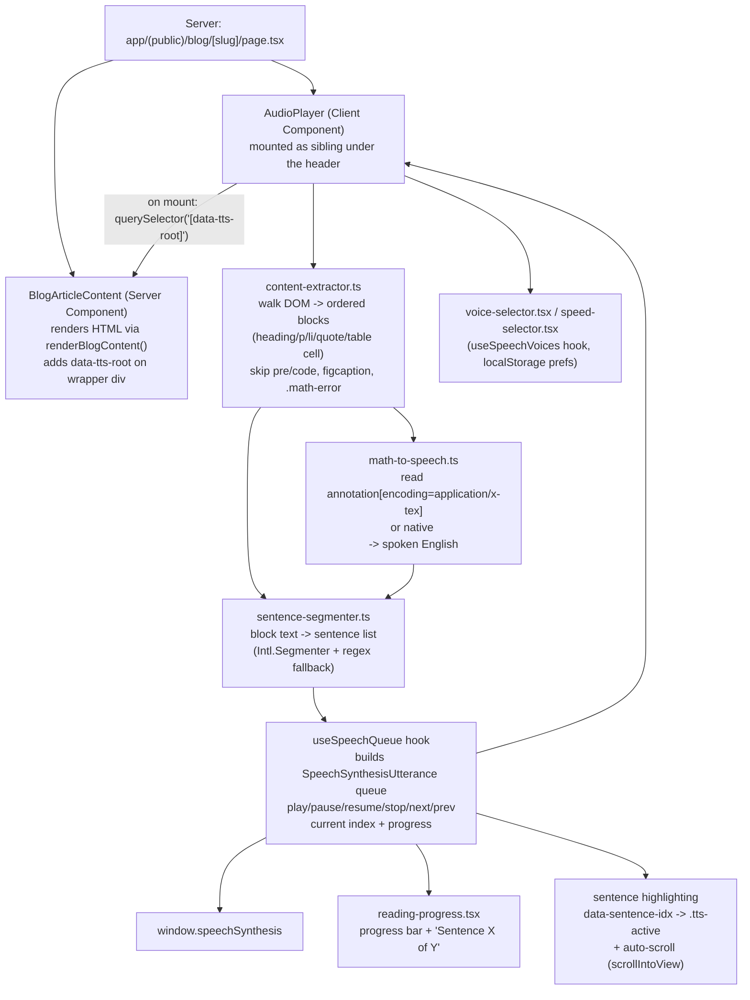

# Audio "Listen to Article" — Implementation Plan

## 0. Explicit assumptions (decided so no further clarification is needed)

- **Scope of what's read aloud:** article body only — title, then headings/paragraphs/lists/quotes/tables found inside the article's content region. The summary/lead line and the FAQ section (`components/public/blog-article-faq.tsx`) are **not** read. (User decision.)
- **Code blocks:** `<pre><code>` content is skipped entirely — never spoken, no "code block" announcement either. (User decision.)
- **No Markdown pipeline:** articles are generated and stored as HTML directly (`lib/ai.ts`'s `content` field is HTML with `h2/h3/p/ul/li`, math as `$...$`/`$$...$$`/MathML), then server-rendered via `renderBlogContent()` (`lib/render-blog-content.ts`) into KaTeX HTML before reaching the client. The research doc's "Phase 3: Support Markdown" therefore does not apply — the extractor walks already-rendered **DOM**, not markdown source.
- **No MathJax + Speech Rule Engine:** KaTeX (already a dependency) always embeds the original LaTeX source in a hidden `<annotation encoding="application/x-tex">` inside the MathML `<semantics>` block it renders (present regardless of KaTeX's render options), and the native-MathML fallback path (`<math>` elements, also passed through by `renderBlogContent`) carries its own readable structure. Both are read directly and converted with a small custom rule table instead of pulling in MathJax + SRE (large bundle, new rendering pipeline, redundant with KaTeX which this app already uses).
- **No new DB columns/migrations.** Voice/speed preference lives in `localStorage` only (per the research doc). If a future need arises to remember prefs server-side per admin, that's an explicit new phase, not part of this plan.
- **Selector collision fix:** `.blog-content` is reused by `blog-article-faq.tsx` for FAQ answer paragraphs, so it cannot be used to scope the reader. `BlogArticleContent` gets one new `data-tts-root` attribute on its wrapper div; the extractor and player always query `[data-tts-root]`, never the bare class.
- **Player is a client component reading live DOM**, not article text passed as a prop. `BlogArticleContent` and the blog detail page (`app/(public)/blog/[slug]/page.tsx`) are Server Components rendering via `dangerouslySetInnerHTML`; `AudioPlayer` mounts as a `"use client"` sibling and, after hydration, does `document.querySelector('[data-tts-root]')` to build its queue. This avoids duplicating/re-serializing the article HTML into client props.
- **Architecture decision (deviation from the source doc):** the doc builds Phase 1 as "speak the whole text" and only introduces chunking/queueing in Phases 8–9, which is effectively a rewrite of the speech engine. Instead, the paragraph/sentence-level queue (`useSpeechQueue`) is built as the foundation starting in **M1**, with the Phase-1 UI as a thin layer on top. Highlighting (M4) and skip/seek (M5) then become additive, not rewrites.
- Milestones are implemented **all at once, in one continuous pass** (M1 → M6), per user preference, rather than pausing for review between each.

---

## 1. Architecture overview



## 2. File structure (mapped onto this repo's actual conventions — no `src/`, flat `app/`/`components/`/`lib/`)

```
lib/tts/
  types.ts               — SpeechState, QueueItem, Sentence, VoicePref, PlayerOptions
  content-extractor.ts    — walk [data-tts-root] DOM -> ordered blocks; skip pre/code, figcaption, .math-error
  sentence-segmenter.ts   — block text -> sentence boundaries (Intl.Segmenter, regex fallback)
  math-to-speech.ts       — LaTeX annotation / MathML text -> spoken English rule table
  storage.ts              — localStorage get/set for voice name + speed

hooks/
  use-speech-queue.ts     — core engine: queue build, play/pause/resume/stop/next/prev, current index, progress, cancels on unmount/route change
  use-speech-voices.ts    — loads voices (handles async `voiceschanged`), restores saved voice by name+lang

components/public/
  audio-player.tsx        — "use client"; Play/Pause/Resume/Stop, speaking indicator; mounted in app/(public)/blog/[slug]/page.tsx under the header
  voice-selector.tsx       — dropdown using existing components/ui/select.tsx
  speed-selector.tsx       — 0.75x/1x/1.25x/1.5x toggle group
  reading-progress.tsx     — progress bar + "Sentence X of Y"
```

Modified existing files:
- `components/public/blog-article-content.tsx` — add `data-tts-root` attribute on the wrapper div; after `renderBlogContent()`, run a post-process step that wraps each extracted sentence in `<span data-sentence-idx="n">` for M4 highlighting (kept out of the AI-generated HTML itself — done at render time, same place LaTeX is currently rendered).
- `app/(public)/blog/[slug]/page.tsx` — mount `<AudioPlayer title={post.title} />` under the `<header>`.
- `app/blog-content.css` — add `.tts-active` highlight style (respecting existing `--blog-*` light/dark tokens) and any player-specific styling not covered by `components/ui/*`.

## 3. Milestone detail

### M1 — Core speech engine + Phase-1 UI (foundation)
- `lib/tts/types.ts`, `lib/tts/storage.ts`.
- `hooks/use-speech-voices.ts`: subscribe to `voiceschanged`, expose available voices, restore/save preferred voice (by `name` + `lang`, since `voice` objects aren't stable across reloads) via `storage.ts`.
- `hooks/use-speech-queue.ts`: accepts an ordered list of text chunks (paragraph-level to start), builds one `SpeechSynthesisUtterance` per chunk, chains `onend` to auto-advance, exposes `play/pause/resume/stop`, `speed` (applies to future utterances + note that `speechSynthesis` doesn't support live rate change on an in-flight utterance — changing speed mid-utterance requires re-queuing from the current position), `isSpeaking`. Always calls `speechSynthesis.cancel()` on unmount and on `visibilitychange`→hidden fallback handling per-browser.
- `components/public/audio-player.tsx` + `voice-selector.tsx` + `speed-selector.tsx`: Play/Pause/Resume/Stop buttons, speaking indicator, wired to the hooks above.
- Mount in `app/(public)/blog/[slug]/page.tsx`.
- For M1, the queue's chunk source is a simple placeholder (e.g. `post.title` + innerText paragraphs) — replaced by the real extractor in M2 without changing the hook's public interface.
- Acceptance: Play/Pause/Resume/Stop/speed/voice all work on Chrome/Edge/Firefox/Safari desktop; voice + speed persist across reloads; leaving the page mid-speech never leaves speech running.

### M2 — Real content extraction (article body only, no markdown)
- Add `data-tts-root` to `blog-article-content.tsx`'s wrapper div.
- `lib/tts/content-extractor.ts`: `querySelectorAll` within `[data-tts-root]` for `h1,h2,h3,h4,p,li,blockquote,th,td`, in document order; read `.textContent` (already plain text since HTML entities are resolved by the DOM); explicitly skip `pre`, `code`, `figcaption`, and `.math-error` nodes (and their descendants); skip empty/whitespace-only nodes.
- `lib/tts/sentence-segmenter.ts`: split each block's text into sentences (prefer `Intl.Segmenter(locale, { granularity: "sentence" })` where available, regex-based `.`/`!`/`?` fallback otherwise); each heading becomes its own single "sentence" for pacing.
- Wire extractor + segmenter output into `useSpeechQueue` as the real chunk source, replacing M1's placeholder.
- Acceptance: reading an article never speaks nav/footer/share/related-posts/FAQ text (those live outside `[data-tts-root]` already) and never speaks code block contents.

### M3 — Math-to-speech
- `lib/tts/math-to-speech.ts`: for each KaTeX-rendered node (`.math-inline`, `.math-display`), read its `annotation[encoding="application/x-tex"]` text; for native `<math>` MathML fallback nodes, read structured child text. Convert via a rule table: superscripts/powers (`x^2` → "x squared", `10^2` → "ten squared" for small integer bases per the doc's example), subscripts, `\sqrt{}` → "the square root of", Greek letter names (`\pi` → "pi", `\beta` → "beta", `\Sigma`/`Σ` → "sigma"), `\frac{a}{b}` → "a over b", common operators (`+ - × ÷ = ≈ ≤ ≥`).
- Extractor (M2) substitutes the converted spoken text in place of the math node's raw text when building each block's string, so sentence segmentation sees natural language instead of symbols.
- Acceptance: articles containing the doc's example formulas (`10^2`, `\pi r^2`, `\sqrt{x}`, `\Sigma`, `\beta`) are read as natural phrases, not symbol names or silence.

### M4 — Highlighting, progress, auto-scroll
- Content-extractor additionally wraps each segmented sentence in `<span data-sentence-idx="n">` inside the live DOM (a lightweight in-place DOM mutation on the client, not touching the server-rendered source) so the player can address individual sentences without re-parsing.
- `use-speech-queue.ts` exposes `currentSentenceIndex`; `audio-player.tsx` toggles a `.tts-active` class on the matching span on each `onboundary`/`onstart` utterance event.
- `.tts-active` style added to `app/blog-content.css` using the existing `--blog-accent` token for light/dark consistency.
- `components/public/reading-progress.tsx`: progress bar + "Sentence X of Y" driven by `currentSentenceIndex` / total.
- Auto-scroll: `scrollIntoView({ block: "center", behavior: "smooth" })` on sentence change; skipped entirely if `window.matchMedia("(prefers-reduced-motion: reduce)")` matches; paused for N seconds after any manual wheel/touch scroll so it doesn't fight the reader.
- Acceptance: the actively-spoken sentence is visibly highlighted and kept on-screen without janky fighting against manual scrolling; progress bar tracks accurately.

### M5 — Skip / seek
- `use-speech-queue.ts`: add `next()`/`previous()` — cancel current utterance, adjust queue pointer, immediately speak the new current item (bounded at start/end of queue).
- Wire to new Skip-forward/back buttons in `audio-player.tsx`.
- Acceptance: skip is instant (no lag/double-speak), correctly resumes highlighting/progress at the new position.

### M6 — Accessibility + cross-browser QA
- Keyboard shortcuts on the article page: `Space` → play/pause, `←`/`→` → previous/next sentence, `Esc` → stop — attached at the article container level and explicitly ignored when focus is inside an `input`/`textarea` (so it doesn't hijack `public-header.tsx`'s search box) or any editable element.
- `aria-live="polite"` region in `audio-player.tsx` announcing state changes ("Reading started", "Paused", "Stopped").
- Manual QA pass: Chrome/Edge/Firefox/Safari desktop, mobile Safari + Chrome — specifically checking (a) voice list availability timing, (b) whether background-tabbing pauses/kills speech, (c) whether rate changes mid-utterance behave as expected once M1's re-queue-on-speed-change logic is in place.

## 4. Known risks / edge cases designed around up front
- `window.speechSynthesis` is a **global singleton** — must `cancel()` on unmount and on route change, or navigating to a second article can stack speech on top of the first.
- **Voices load asynchronously**; `getVoices()` can return `[]` on first call — must listen for `voiceschanged`.
- **No live rate change** on an already-queued `SpeechSynthesisUtterance` — changing speed mid-read requires canceling and re-queuing from the current sentence, not mutating the in-flight utterance.
- **Mobile Safari/Chrome** may pause or cancel speech when the tab is backgrounded — surfaced to the user as a stopped/paused state rather than a silent hang.
- **Selector collision**: never query the bare `.blog-content` class (reused by FAQ answers) — always `[data-tts-root]`.
- **Malformed math**: `.math-error` nodes (already handled by `renderBlogContent`) must be skipped by the extractor rather than having their raw LaTeX source read aloud as garbage.

## 5. Explicit non-goals for this plan
- No server-generated audio files / TTS API (e.g. cloud TTS) — this is browser-`SpeechSynthesis`-only, per the research doc.
- No FAQ or summary/lead narration (user decision — body only).
- No code-block narration in any form (user decision — skipped entirely, not even announced).
- No per-admin server-persisted voice/speed preference — `localStorage` only.
